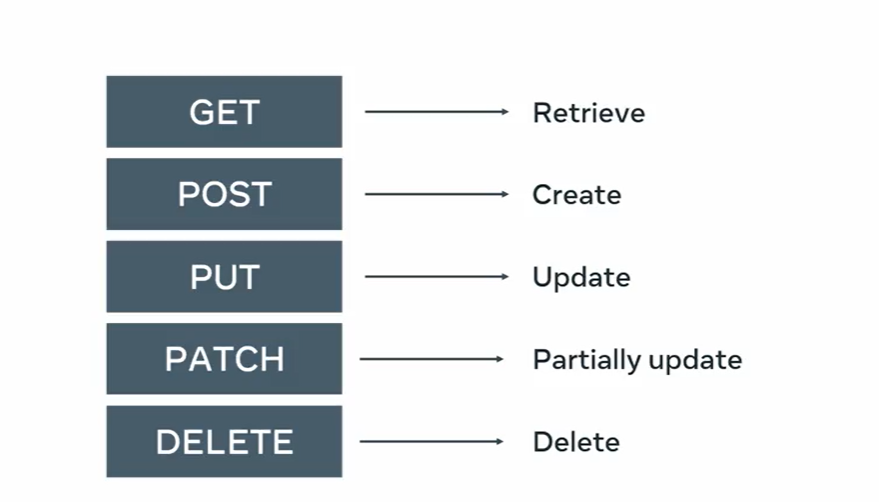

# DRF-API
REST API Project using the RESTful and DRF 

# User in project : 
Managers
Customer
Delivery Crew

# Registration , Auth
- api/users

- Assign it to the groups 
- api/users/{userID}/groups

# token implementation 
-- What type of token is required for this endpoint

# Manager role :
1. Edit the Menu , update ,delete
2. Update User role
api/user/{userid}/groups

# Customer rule:
if user doesn't belong to any group the usr is customer 
- Cutomer  View: 
    - Menu item get 
    - Browse 
    - Filter 
    - Search view 
2. API to add item in the cart 
# api/users/{userID}/cat/menuitems

3. Place ORDER 
API/ORDERS
# Empty THE CART WHEN order is placed
# Flush the cart : api/users/userID/cart
# One Cart for the One custoner # It should have multiple items

4. Delivery Process API
- Api endpoints to browse, assign and filter /api/orders , orderID, } -- Manager token
- Filter the order by their status of delivered , pending }-- manager token
-api/orders/?status=delivered

5. Borwse , Mark: 
api/orders
api/orders/{orderID} --- > Mark all orders by using delivery person token

6. View Own Orders
api/orders ----> All orders , customer token

7. Implement the throttling to the API calls for 5api/mintues
# Required HTTP Request

# Return the appropirate status code
- if the sesssion auth class is used during the the dev , commit out in the prod

# Models.py 
- Category: title, slug
- menuItem - title, price feature , category (FK)
- Cart: user(FK), menuitem, quantity, unit price, total price 
        - Meta :
        uniuquetogether[user, menuitem]
- Order:
user, delivery_crew(ondel null, rerlated_name=varname , null=ture)
status , total, date
# related_name is set bcz the both user and delivery_crew refrencing to the same user_ID in user table

- OrderItem
order, menuitem, quantity, unit-price, price, #  6 dig, 2 decimal 
Meta:
uniq_together = ['order', 'Menuitem'],